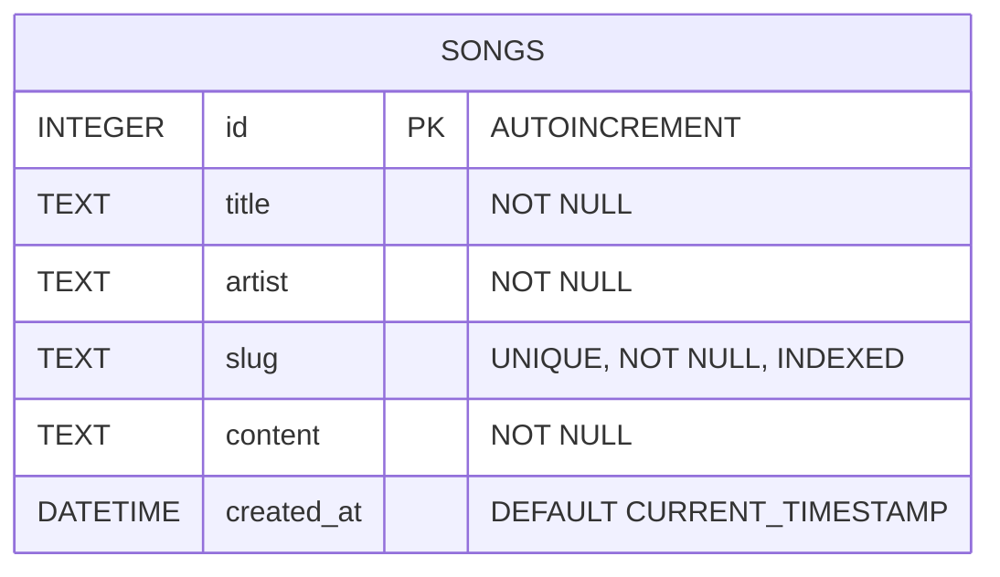
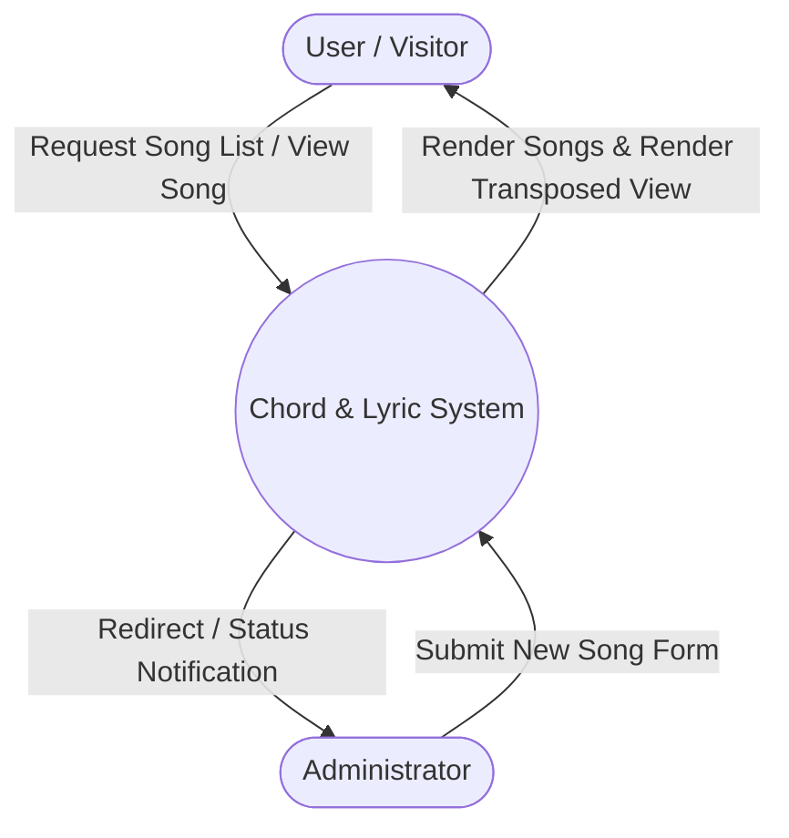
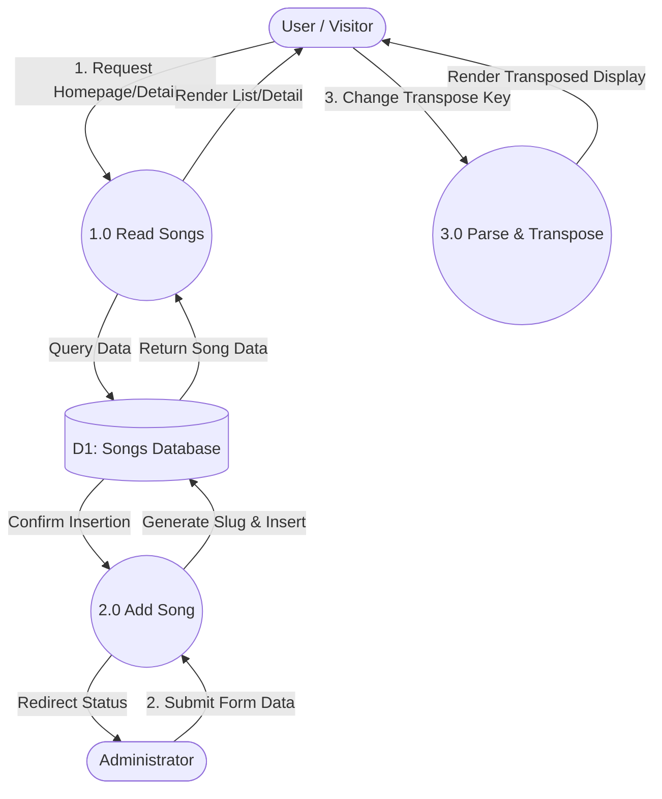
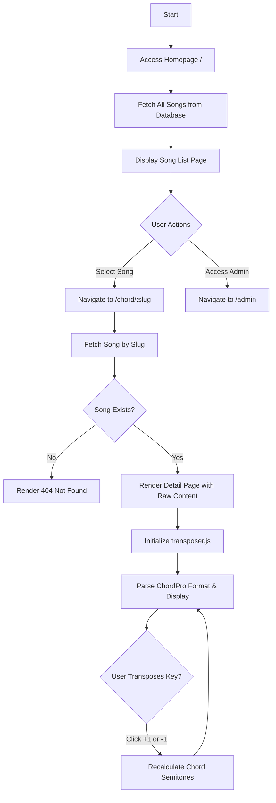
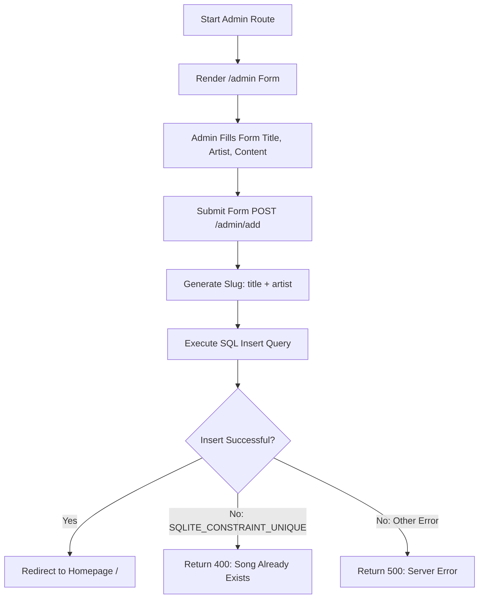

# Chord & Lyric Management Application

A lightweight Web application built with Node.js, Express, and SQLite for managing and displaying song chords and lyrics with real-time dynamic transposition capabilities.

---

## Key Features

- **Song Catalog:** Displays all available songs sorted alphabetically by title.
- **Dynamic Transposition:** Transposes musical keys in real time using client-side JavaScript.
- **ChordPro Parsing:** Formats custom bracket notation `[Chord]` into aligned text displays.
- **Admin Management:** Provides a submission portal to add new song entries into the database.
- **Automatic Slug Generation:** Converts titles and artist names into clean, URL-friendly identifiers.
- **SQLite Performance Optimization:** Uses Write-Ahead Logging (WAL) for high-performance read and write access.

---

## Technology Stack

- **Backend:** Node.js, Express.js
- **Database:** SQLite (via `better-sqlite3`)
- **Template Engine:** EJS (Embedded JavaScript)
- **Frontend Architecture:** Vanilla JavaScript, HTML5, CSS3

---

## Project Structure

```text
├── app.js               # Application entry point and route configurations
├── schema.js            # SQLite database initialization and model logic
├── package.json         # Dependencies and scripts
├── public/
│   └── js/
│       └── transposer.js # Client-side dynamic key transposition logic
└── views/
    ├── index.ejs        # Main public index view
    ├── detail.ejs       # Song view page with transposition controls
    └── admin.ejs        # Admin form for submitting new songs
```

---

## Database Architecture (ERD)



---

## Data Flow Diagrams (DFD)

### Data Flow Diagram Level 0 (Context Diagram)



### Data Flow Diagram Level 1



---

## Workflows and Flowcharts

### System Flowchart: User Navigation & Transposition



### System Flowchart: Admin Song Addition



---

## Installation & Setup

1. **Clone or Extract Project Files**
   Ensure all files match the structural layout shown in the repository.

2. **Install Dependencies**
   Run the following command in the root folder:
   ```bash
   npm install
   ```

3. **Start the Application**
   ```bash
   node app.js
   ```

4. **Access in Browser**
   - Main Page: `http://localhost:3000`
   - Admin Input Page: `http://localhost:3000/admin`